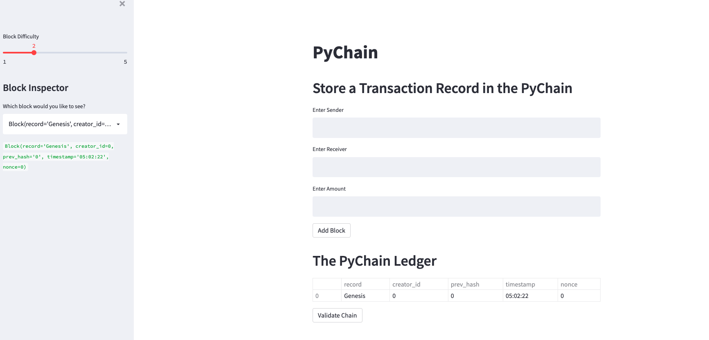
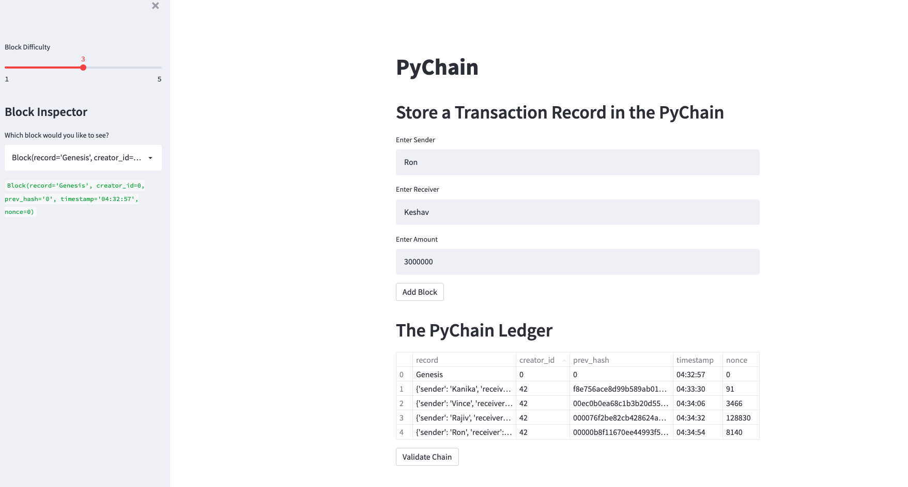
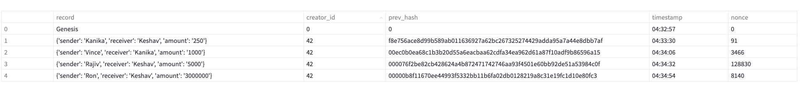
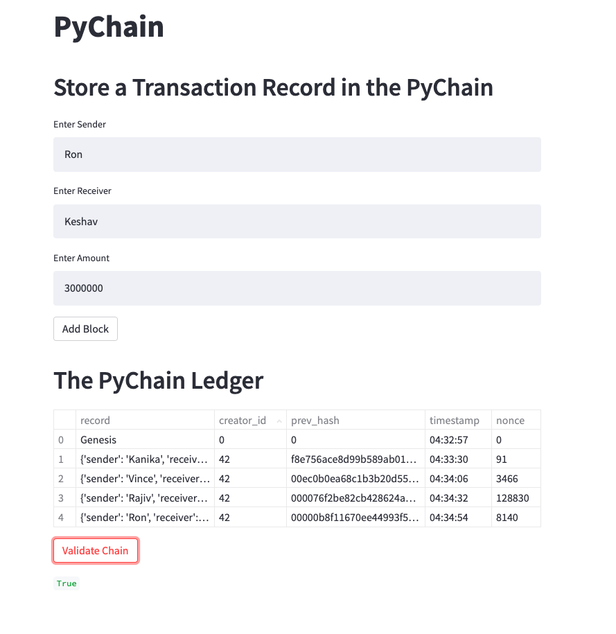

# **Streamlit Blockchain Application**

This purpose of this project is to develop an application that allows users to add transaction records to the blockchain and verify the validity of the blockchain.

---

## **Technologies**

This program is written in python and uses the following libraries: streamlit, pandas, hashlib, datetime, dataclasses, and typing specifically the Any and List imports. 

To run this application, the user must execute the following command within the terminal, once in the folder where the app lies: 'streamlit run pychain.py'.

The application will prompt the user to enter the following components of class Record: sender, receiver, and amount to create a record in the Pychain Ledger.

The user can also adjust the Block Difficulty to change the difficulty of the computational problem that the computer must solve to demonstrate proof of work. 

```python

    class PyChain:
    chain: List[Block]
    difficulty: int = 4

    def proof_of_work(self, block):

        calculated_hash = block.hash_block()

        num_of_zeros = "0" * self.difficulty

        while not calculated_hash.startswith(num_of_zeros):

            block.nonce += 1

            calculated_hash = block.hash_block()

        print("Winning Hash", calculated_hash)
        return block
```
---

## **Installation Guide**

1. First you would want to navigate to Terminal to the location where pychain.py resides. Then you run in dev, 'streamlit run pychain.py'.

2. You should arrive at this homepage after running the app. 



3. Once complete, you can enter strings for sender, receiver and a float for amount in the respective text boxes to add a record to block and the block to the ledger.





4. Now you have created a blockchain storing records and you can verify the validity of the blockchain with the Validate Chain button at the bottom of the ledger.



---

## **Contributors**

The author of this application is Kanika Sharma with Github username kinsnik, who also goes by Niki. She can be reached at ksharmaconnect3@gmail.com or on LinkedIn under Kanika Sharma: https://www.linkedin.com/in/kanika-sharma-aa28a6134/.

---

## **License**

Users have permissions to read this file, but not write or edit the code. The code within, if used, should be properly recognized and cited as the intellectual property of the author. 

